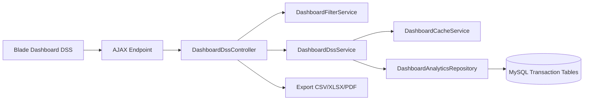
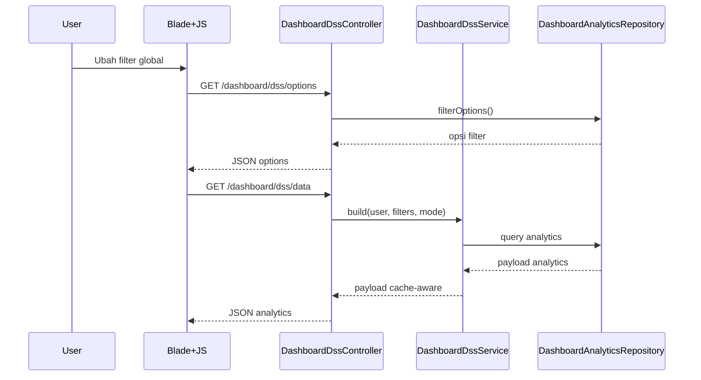

# Business Intelligence & Analytics Module

Modul ini melanjutkan implementasi Dashboard Pancawaluya tanpa merombak desain halaman yang sudah ada. Fokusnya adalah menambah kapabilitas analytics, ranking, trend, comparative analysis, correlation, predictive recommendation, executive summary, export, cache, dan pengujian.

## 1) Analytics Architecture

Komponen inti:
- Controller: orkestrasi request/filter/response analytics dan export.
- Service: komposisi payload analytics per mode dan cache-aware.
- Repository: query agregasi read-only dari data transaksi dan statistik karakter.
- Filter service: normalisasi filter global lintas chart.

## 2) KPI Definition

| KPI | Definisi | Sumber Data |
|---|---|---|
| Total Siswa | Jumlah siswa dalam scope filter + role | students |
| Total Guru | Jumlah guru dalam scope filter + role | teachers |
| Total Penghargaan | Total transaksi reward | reward_transactions |
| Total Pelanggaran | Total transaksi violation | violation_transactions |
| SP1/SP2/SP3 | Distribusi surat peringatan per level | student_warning_letters |
| Rata-rata Karakter | Rata-rata character_score_total | student_character_statistics |
| Validasi Tertunda | Reward + violation status pending | reward_transactions, violation_transactions |

## 3) Radar Chart Design

Dimensi radar:
- Cageur
- Bageur
- Bener
- Pinter
- Singer

Seri radar:
- Current Score
- Previous Semester
- School Average
- Class Average
- Department Average

Komparasi didukung:
- Student vs Class
- Student vs Department
- Student vs School
- Class vs School
- Department vs School

## 4) Character Analytics

Output backend mencakup:
- Character distribution (sangat_baik/baik/cukup/perlu_pendampingan)
- Character growth percentage
- Character decline count
- Character trend series
- Character achievement rate
- Character comparison by dimension
- Character progress timeline
- Top performing character dimension
- Lowest character dimension
- Character heatmap (kelas x dimensi)
- Auto insight narrative

## 5) Reward Analytics

Output backend mencakup:
- Reward trend
- Reward category distribution
- Monthly reward
- Teacher contribution
- Department reward
- Class reward
- Most rewarded students
- Most active teachers
- Most effective reward category
- Reward growth percentage

## 6) Violation Analytics

Output backend mencakup:
- Violation trend
- Violation category
- Violation frequency
- Repeat violations
- Violation by department
- Violation by teacher
- Violation by month
- Violation by class
- Top violations
- Risk indicators (tinggi/sedang/rendah)

## 7) SP Analytics

Output backend mencakup:
- SP1/SP2/SP3 distribution
- SP trend
- Students near SP
- SP growth percentage
- Department comparison
- Class comparison
- Early warning message

## 8) Ranking Engine

Ranking yang dihasilkan:
- Best student
- Highest violations
- Highest rewards
- Most active teachers

Konfigurasi Top N:
- Top 10
- Top 20
- Top 50

## 9) Comparative Analytics

Perbandingan tersedia:
- Class vs class
- Department vs department
- Teacher vs teacher
- Semester vs semester
- Academic year vs academic year
- Male vs female
- Reward vs violation
- Character vs attendance

## 10) Trend Analytics

Trend yang disediakan:
- Reward trend periodik
- Violation trend periodik
- Character growth periodik
- SP distribution periodik

Metrik trend turunan:
- Growth percentage
- Delta
- Direction up/down

## 11) Correlation Analysis

Analisis korelasi menghasilkan:
- Correlation matrix (Pearson)
- Scatter plot karakter vs kehadiran
- Correlation coefficient ringkas
- Interpretasi otomatis pasangan korelasi terkuat

## 12) Predictive Analytics

Rule-based prediction (tanpa machine learning):
- Likely receive SP
- Likely to improve
- Requiring counseling
- Deserving appreciation
- Declining character

Setiap prediksi memiliki reason eksplisit.

## 13) Recommendation Engine

Rekomendasi otomatis berbasis alert:
- Konseling
- Program pembinaan karakter
- Penguatan positif/penghargaan

Setiap rekomendasi memuat:
- Tipe
- Prioritas (tinggi/sedang/rendah)
- Alasan/message

## 14) Executive Summary Generator

Ringkasan eksekutif otomatis memuat:
- Snapshot karakter
- Pertumbuhan penghargaan
- Perubahan pelanggaran
- Dimensi terkuat
- Pelanggaran dominan

Output berbentuk narrative array + highlights key metrics.

## 15) Visualization Specification

| Kebutuhan | Visual utama |
|---|---|
| Distribusi kategori | Pie/Donut |
| Tren waktu | Line/Area |
| Ranking | Horizontal Bar/Leaderboard |
| Komparasi antarkelompok | Grouped Bar |
| Korelasi | Scatter/Bubble |
| Radar karakter | Radar Chart |
| Heatmap karakter/perilaku | Heatmap grid |

Catatan implementasi: modul mempertahankan UI dashboard saat ini, data analytics lengkap disuplai melalui payload AJAX agar komponen visual dapat ditambahkan bertahap tanpa redesign layout.

## 16) AJAX Flow

## 17) Cache Strategy

Strategi cache:
- Cache key berbasis role, scope user, mode, dan fingerprint filter.
- TTL 2 menit untuk menjaga data relatif segar.
- Versioned cache key untuk invalidasi cepat melalui bump version.

Invalidasi:
- Naikkan versi cache saat transaksi reward/violation/SP berubah.
- TTL pendek sebagai fallback untuk driver cache tanpa tag.

## 18) Performance Optimization

Penerapan optimasi:
- Query agregasi via groupBy/selectRaw.
- Pengurangan query berat saat mode ringkas.
- Pembatasan Top N untuk ranking.
- DataTables server-side untuk aktivitas terbaru.
- Scope dan filter diterapkan di level query (bukan in-memory).
- Hindari N+1 dengan eager loading terarah.

Target operasional:
- Endpoint data analytics ter-cache untuk menjaga latency rendah pada akses berulang.

## 19) Testing Strategy

Pengujian yang disiapkan/diupdate:
- Service contract test untuk payload analytics utama.
- Route registration test termasuk endpoint export.
- Middleware auth test endpoint DSS.

Saran penambahan test lanjutan:
- Authorization matrix per role + scope data.
- Export smoke test per format CSV/XLSX/PDF.
- Correlation dan predictive rules test berbasis fixture.
- Performance baseline test endpoint data dengan seed besar.

## 20) Final Analytics Review

Status implementasi:
- Selesai menambahkan domain analytics utama di backend (character, reward, violation, SP, ranking, comparative, correlation, predictive, executive summary).
- Selesai menambahkan global filters tambahan: gender, grade level, top ranking, compare mode.
- Selesai menambahkan export analytics: CSV, XLSX, PDF + print.
- Selesai mempertahankan desain dashboard existing (tanpa redesign layout).

## Implemented Files

- app/Services/Dashboard/DashboardFilterService.php
- app/Repositories/Contracts/Dashboard/DashboardAnalyticsRepositoryInterface.php
- app/Repositories/Dashboard/DashboardAnalyticsRepository.php
- app/Services/Dashboard/DashboardDssService.php
- app/Http/Controllers/Dashboard/DashboardDssController.php
- app/Exports/DashboardDssAnalyticsExport.php
- resources/views/components/dashboard/filter-bar.blade.php
- resources/views/dashboard/dss/index.blade.php
- resources/views/dashboard/dss/script.blade.php
- resources/views/dashboard/dss/export-pdf.blade.php
- routes/web.php
- tests/Feature/Dashboard/DashboardServiceContractTest.php
- tests/Feature/Dashboard/DashboardRouteRegistrationTest.php
