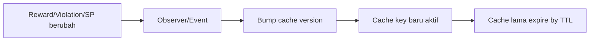
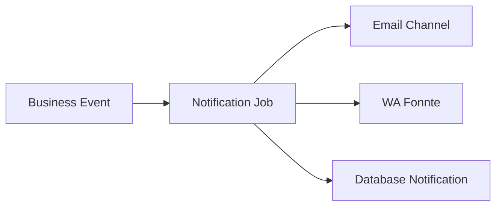
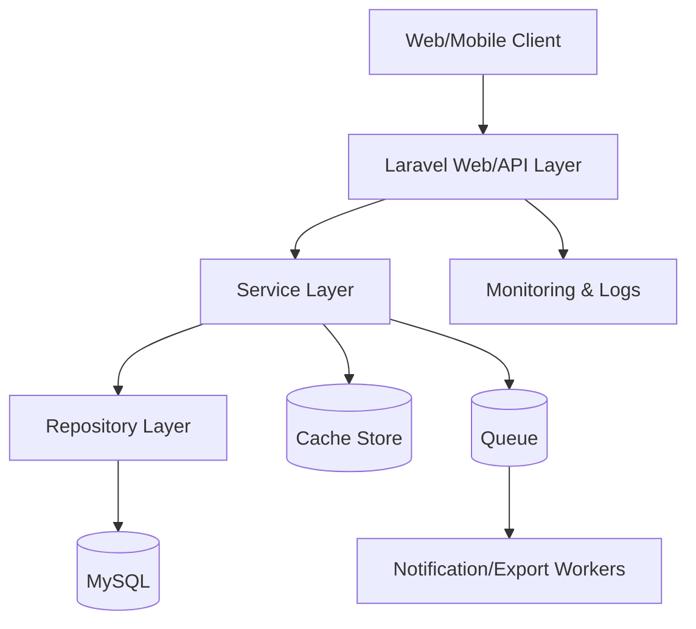

# Enterprise Production Readiness

Dokumen ini menutup Prompt 9 dengan fokus kesiapan produksi untuk aplikasi Laravel 12 (Absensi + Pancawaluya + Analytics) pada shared hosting saat ini dan jalur migrasi ke VPS/cloud.

## 1. Production Readiness Assessment

| Area | Status Saat Ini | Risiko | Prioritas |
|---|---|---|---|
| Arsitektur Modular | Baik (Repository + Service sudah dipakai) | Inkonsistensi pada modul baru jika tidak dijaga | Tinggi |
| Performa Query | Menengah (beberapa agregasi berat) | Latensi saat jam sibuk | Tinggi |
| Keamanan Akses | Baik (Gate/Role tersedia) | Rate limit dan audit trail belum menyeluruh | Tinggi |
| Queue Asinkron | Menengah (database queue tersedia) | Beban request sinkron untuk proses berat | Tinggi |
| Monitoring | Dasar (log default + route health) | Sulit deteksi bottleneck cepat | Tinggi |
| Backup & Restore | Belum terstandar runbook | Risiko kehilangan data | Kritis |

Kesimpulan: aplikasi siap go-live terbatas, namun untuk enterprise perlu hardening operasi, observability, dan proses DR (disaster recovery).

## 2. Performance Optimization

Rekomendasi implementasi:
- Pastikan semua tabel transaksi besar memakai indeks periode dan foreign key filter.
- Pakai server-side DataTables untuk list > 5.000 baris.
- Pindahkan export PDF/Excel dan refresh statistik ke queue.
- Gunakan pagination/cursor untuk endpoint API mobile.
- Batasi query ranking ke Top N (10/20/50) sesuai filter.
- Gunakan eager loading konsisten pada relasi student/class/teacher.
- Tambahkan budget query per endpoint melalui profiling (Telescope di staging, tidak di production public).

SQL observability (manual):
```sql
EXPLAIN FORMAT=JSON
SELECT *
FROM reward_transactions
WHERE academic_year_id = ?
  AND semester = ?
  AND transaction_date BETWEEN ? AND ?;
```

## 3. Database Optimization

Indeks prioritas (cek sudah ada/duplikat sebelum apply):

| Tabel | Kolom | Tujuan |
|---|---|---|
| reward_transactions | (academic_year_id, semester, transaction_date) | Filter dashboard/trend |
| violation_transactions | (academic_year_id, semester, transaction_date) | Filter dashboard/trend |
| student_character_statistics | (academic_year_id, semester, character_score_total) | Ranking/analytics |
| student_warning_letters | (student_id, academic_year_id, semester, status) | SP analytics |
| pancawaluya_transaction_histories | (student_id, transaction_date), (reference_type, reference_id) | Timeline/audit |

Strategi data jangka panjang:
- Archive strategy: data transaksi > 24 bulan ke tabel arsip per tahun.
- History strategy: simpan tabel histori immutable untuk audit.
- Materialized statistics alternative: tabel statistik harian/mingguan hasil job terjadwal.

## 4. Cache Strategy

Layer cache:
- Dashboard cache (role + scope + filter).
- Ranking cache (Top N per filter).
- Character/radar cache.
- Filter options cache (tahun ajaran, jurusan, kelas).
- Route/config/view cache saat deploy.

Invalidasi:


TTL rekomendasi:
- Dashboard ringkas: 60-120 detik.
- Analytics detail: 120-300 detik.
- Filter master: 10-30 menit.

## 5. Queue Strategy

Job yang wajib antrian:
- Notifikasi email/WA/database.
- Export PDF/Excel besar.
- Rebuild statistik karakter.
- Refresh ranking dan summary analytics.

Koneksi:
- Shared hosting: `database` queue.
- VPS/cloud: `redis` queue + supervisor.

Retry strategy:
- `--tries=3 --backoff=10,30,60`.
- Failed job table wajib aktif.
- Jalankan pruning failed jobs berkala.

## 6. Security Hardening

Checklist keamanan:
- Authentication: wajib HTTPS + secure cookie pada production.
- Authorization: semua endpoint sensitif wajib Gate/Policy.
- Validation: FormRequest untuk semua write endpoint.
- Mass assignment: fillable dijaga, hindari unguard.
- File upload: validasi mime/size + random filename + storage private untuk bukti sensitif.
- Session: rotating session ID setelah login.
- Rate limiting: endpoint login, export, analytics AJAX.
- Audit trail: catat before/after untuk mutasi penting.

Rate limiter rekomendasi:
- Login: 5 req/menit/IP+username.
- Export analytics: 10 req/menit/user.
- API mobile: 60 req/menit/token.

## 7. Reporting Module

Laporan enterprise yang harus distandarkan:
- Student Character Report
- Reward Report
- Violation Report
- SP Report
- Teacher Activity Report
- Homeroom/Counselor/Student Affairs Report
- School/Department/Class Summary

Format output:
- PDF, Excel, CSV, Print.
- Semua report menyertakan filter metadata dan timestamp.

## 8. Notification Integration

Channel roadmap:
- Email (aktif sekarang)
- Database notifications
- WhatsApp Gateway (Fonnte)
- Future: Firebase push

Event trigger prioritas:
- Reward dibuat/disetujui
- Violation dibuat/disetujui
- SP1/SP2/SP3 terbit
- Character improvement milestone

Arsitektur:


## 9. Backup & Recovery

Target backup:
- Daily DB backup (retensi 14-30 hari)
- Weekly full backup (db + storage)
- Monthly archive offsite

Recovery objective:
- RPO: <= 24 jam
- RTO: <= 2 jam

Runbook ringkas:
1. Put maintenance mode.
2. Restore database terakhir yang valid.
3. Restore storage upload.
4. Jalankan cache clear dan health check.
5. Validasi sample data kritikal.

## 10. Monitoring Strategy

Minimal observability stack:
- App health: `/up`
- Laravel logs (daily)
- Queue failed jobs monitor
- DB slow query monitor
- Disk usage monitor
- Response time dashboard (p95/p99)

Alert penting:
- Error rate > 2%
- Queue delay > 60 detik
- Disk usage > 85%
- DB connection failure

## 11. Logging Strategy

Klasifikasi log:
- Business log (aksi domain)
- Activity log (siapa melakukan apa)
- Audit log (old/new value)
- Security log (login gagal, forbidden)
- Performance log (slow endpoint)
- Queue log (job fail/retry)

Prinsip:
- JSON structured log untuk agregasi.
- Correlation ID per request.
- Sanitasi data sensitif (password/token).

## 12. Testing Strategy

Matriks pengujian:

| Jenis Test | Fokus |
|---|---|
| Unit | Helper, service kecil, rule prediksi |
| Feature | Auth, policy, route, export, analytics response |
| Integration | DB + queue + cache integration |
| Browser | Alur absensi, dashboard interaktif |
| Queue | retry/backoff/failed handling |
| Notification | event-to-channel correctness |
| Performance | endpoint heavy saat beban |

## 13. Load Test Plan

Skema simulasi:
- 100 concurrent users
- 300 concurrent users
- 500 concurrent users
- 800 student attendance writes
- 100 teacher attendance writes

KPI load test:
- p95 response time
- error rate
- throughput req/s
- CPU, memory, DB connection usage

Acceptance awal:
- p95 < 2.5s untuk endpoint utama.
- error rate < 1%.

## 14. Deployment Checklist

Checklist produksi:
1. Freeze branch release.
2. Pull code + `composer install --no-dev --optimize-autoloader`.
3. Set `.env` production dan secret.
4. `php artisan migrate --force`.
5. `php artisan config:cache && php artisan route:cache && php artisan view:cache`.
6. Restart queue worker/supervisor.
7. Smoke test login, absensi, dashboard, export.
8. Monitor 30 menit pasca deploy.

Rollback:
- Gunakan tag release sebelumnya.
- Jalankan rollback migration jika backward incompatible.
- Restore backup jika data issue.

## 15. Hosting Recommendation

Tahap 1 (shared hosting):
- Tetap gunakan database queue.
- Jadwalkan worker via cron tiap menit.
- Batasi job berat dan jalankan off-peak.

Tahap 2 (VPS):
- Nginx + PHP-FPM + MySQL + Redis.
- Supervisor untuk queue workers.
- Monitoring node-level (CPU/RAM/Disk).

Tahap 3 (cloud):
- Managed DB + Redis + object storage.
- Horizontal scaling worker.

## 16. Cron Job Configuration

Task terjadwal minimum:
- queue worker trigger
- queue prune
- backup harian
- cleanup logs lama
- recalculation statistik karakter
- refresh analytics summary

Contoh jadwal disediakan pada dokumen operasional pendamping.

## 17. API Readiness

Roadmap API:
- REST API versioning (`/api/v1`).
- Sanctum token scopes per role.
- Resource transformers konsisten.
- Rate limit per client.
- OpenAPI spec untuk Flutter/Android/iOS/React/Vue.
- Future GraphQL hanya untuk read-heavy analytics.

## 18. Technical Documentation Plan

Dokumen wajib:
- Technical architecture
- Database dictionary + ERD
- API contract
- Installation guide
- Deployment guide
- Role-based user manual (admin/guru/wali/bk/kesiswaan/siswa)
- Developer contribution guide

## 19. Code Quality Review

Standar:
- PSR-12 + Laravel Pint pada CI.
- Service + repository untuk logic berat.
- Observer/event untuk side effects.
- DRY/KISS enforcement saat review.
- Static analysis baseline (PHPStan level bertahap).

## 20. Risk Assessment

| Risiko | Dampak | Mitigasi |
|---|---|---|
| Query analytics berat | Dashboard lambat | Cache + statistik materialized |
| Job menumpuk | Notifikasi/report terlambat | Supervisor + retry + scaling worker |
| Human error deploy | Downtime | Checklist + rollback + staging gate |
| Backup gagal | Data loss | Backup verification + restore drill |
| Privilege escalation | Kebocoran data | Policy audit + permission review berkala |

## 21. Improvement Roadmap

Roadmap 90 hari:
- Minggu 1-2: hardening security + rate limit + log policy.
- Minggu 3-4: queue offloading export/notifikasi/statistik.
- Minggu 5-6: load test dan query optimization lanjutan.
- Minggu 7-8: full monitoring dashboard + alerting.
- Minggu 9-12: migrasi bertahap ke VPS + redis + supervisor.

## 22. Enterprise Production Checklist

| Item | Status Target |
|---|---|
| SSL aktif penuh | Wajib |
| Queue worker stabil | Wajib |
| Backup otomatis + uji restore | Wajib |
| Monitoring + alerting | Wajib |
| Load test baseline terdokumentasi | Wajib |
| SOP deploy dan rollback | Wajib |
| SOP incident response | Wajib |

## 23. Final Architecture Review



Final verdict:
- Arsitektur sudah berada pada jalur enterprise-ready.
- Peningkatan kritikal tersisa ada pada operasi produksi: queue worker management, backup restore drill, observability, dan load governance.
- Dengan checklist ini, sistem siap ditingkatkan dari shared hosting ke VPS/cloud tanpa redesign modul bisnis.
